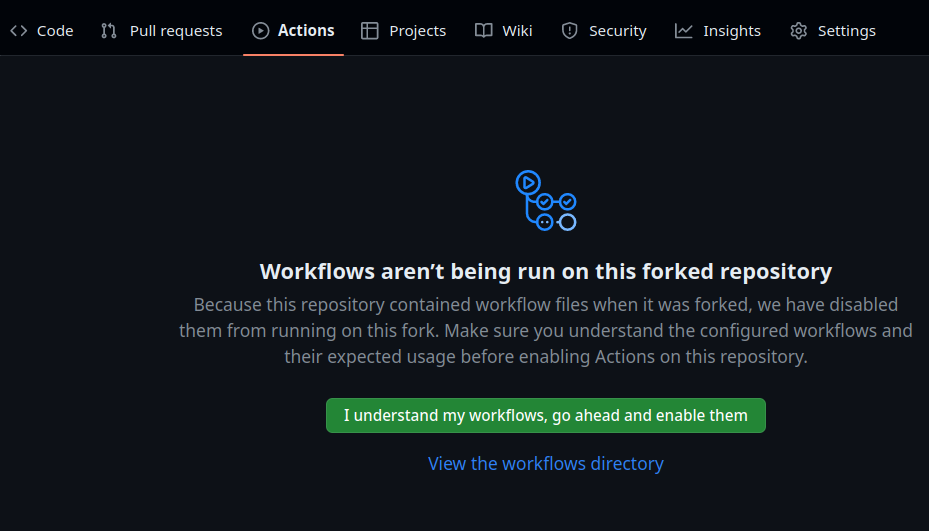

# Template for building devcontainer images

## Purpose:

To prepare GitHub codespaces for each session with the required software for the given theme, a linux container needs to be built.

## How to use:

Fork this repo to a new name such as `devcontainer-??????` (maybe this repo can be turned into a "github repo template").
Then, edit the Dockerfile to install the required software for your theme.

Note that GitHub actions need to be enabled on the fork repo:

Then, edit the `.github/workflows/build.yml` file to change the name of the image to be built and the name of the image to be pushed to the GH container registry.

Finally, edit the `.devcontainer/devcontainer.json` file to change the name of the image to be used for the devcontainer.

### Scope of this template:

- Include standard things in Dockerfile expected by GH codespaces (such as users)
- build the container image with GH actions
- push the image to GH container registry
